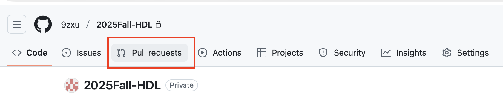
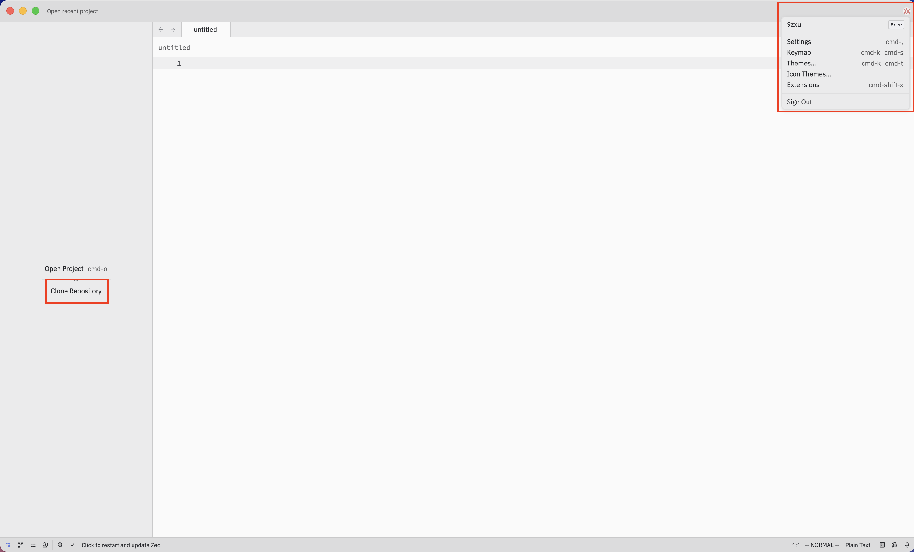
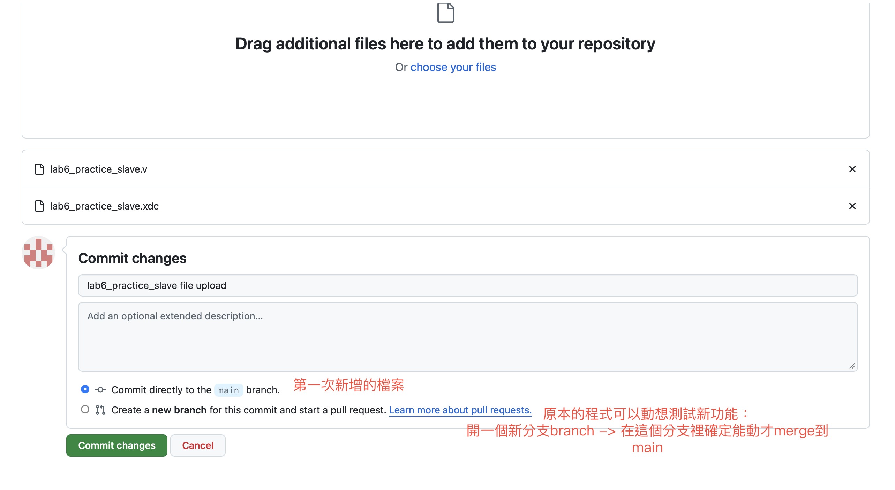

# github collaborate tutorial

## How to collaborate
- !!!切換branch一定要先commit或stash暫存目前的更改，不然會弄髒新的branch

1. 開始實作新功能：建立一個新branch

```sh
# create a new branch (but doesn't switch into it) if needed
git branch <branch-name>
# switch into a new branch, commits must be done in the current branch
git checkout <branch-name>

# or
# 建立並切換到新功能的 branch
git checkout -b <branch-name>
```

2. 平常做完去睡覺之前
```sh
# 暫存
# . 是指目前資料夾的意思
git add .
# 確認目前工作區
git status
```
- `add` 之後會變成綠色
- 還沒 `add` 的是黃色

3. 完成目前工作，合併進度

```sh
# 在你的功能 branch 上
git add .

# commit 當前工作
git commit -m "<這次改了什麼>"

# 把最新 main 合進來（更新自己）
git pull origin main

# 處理衝突 & 除錯
# 修完後
git add .
git commit -m "fix conflicts and update"

# 把你這個 branch 推上遠端
git push origin <你的branch名字>
```
!!!接下來去 GitHub 網頁開 Pull Request，請求merge到main


4. 還沒完成目前工作，但要換到別的branch去修bug

```sh
# 暫存未完成的工作
git add .
git stash

# 切到修 bug 的 branch
git checkout <bug-branch>

# 修完 bug 後
git add .
git commit -m "bugfix..."

# 這行你漏掉了，不 push 是沒人能看到 bug 修好了
git push origin <bug-branch>

# 回到原本的工作 branch
git checkout <original-branch>

# 把之前 stash 的未完成工作拿回來
git stash pop
```

### How to start
#### clone the repo
- where is the link

- by command line

- in ide

#### add source file
- eg.template file


