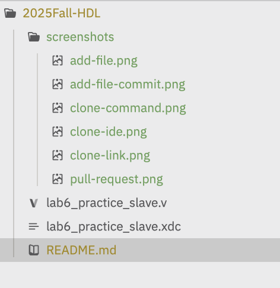
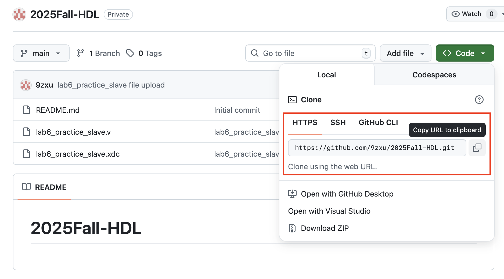
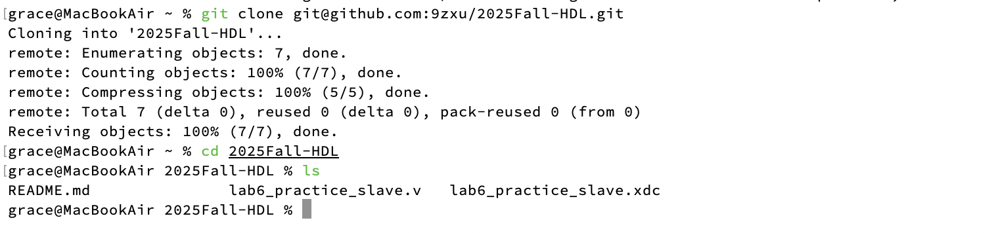
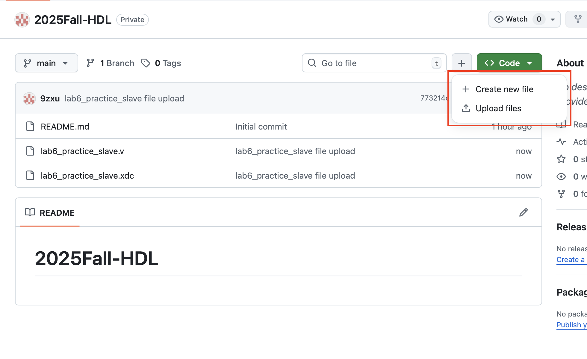

# GitHub 協作教學

## 協作流程

> ⚠️ 切換 branch 前務必先 `commit` 或 `stash`，暫存目前的修改，否則會把未完成的變更帶進新的 branch，弄髒它。

### 1. 開始新功能：建立新 branch

```sh
# 建立新 branch（但不會切換過去）
git branch <branch-name>
# 切換到該 branch，之後的 commit 都會記錄在這裡
git checkout <branch-name>

# 或者一次完成：建立並切換到新 branch
git checkout -b <branch-name>
```

### 2. 收工前先暫存進度

```sh
# 加入暫存區（. 代表目前資料夾下的所有變更）
git add .
# 確認目前工作區狀態
git status
```

- 已經 `add` 的檔案顯示為綠色
- 尚未 `add` 的檔案顯示為黃色



### 3. 完成工作，合併進度

```sh
# 在你的功能 branch 上
git add .

# commit 目前的工作
git commit -m "<這次改了什麼>"

# 拉取最新的 main，更新自己的 branch
git pull origin main

# 若有衝突，手動處理後再次 add 並 commit
git add .
git commit -m "fix conflicts and update"

# 把這個 branch 推上遠端
git push origin <你的branch名字>
```

推送完成後，到 GitHub 網頁開一個 Pull Request，請求合併進 main。


### 4. 工作做到一半，臨時要切去修 bug

```sh
# 暫存尚未完成的工作
git add .
git stash

# 切到修 bug 的 branch
git checkout <bug-branch>

# 修完後 commit
git add .
git commit -m "bugfix..."

# 別忘了推上遠端，否則沒人知道 bug 已修好
git push origin <bug-branch>

# 回到原本的工作 branch
git checkout <original-branch>

# 把剛才 stash 的進度還原回來
git stash pop
```

## 新手上路

### Clone 專案

先在 GitHub 上找到 clone 連結：



用命令列 clone：



或是直接在 IDE 中 clone：


### 新增檔案

以新增一個 template 檔案為例：



commit 新增的檔案：


